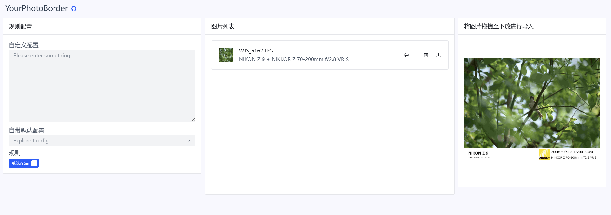

# YourPhotoBorder-Web
## Background
 - 将📷相机照片加上相机参数的边框(Add a border of camera parameters to the photo)
 - Python Version -> https://github.com/sprayman1999/YourPhotoBorder
## Try It！
 - open this link -> http://your-photo-border-web.gdb.wiki
 
## Has question?
 - 请提交你的issue，我会尽快处理(Please submit your issue and I will process it as soon as possible.)
